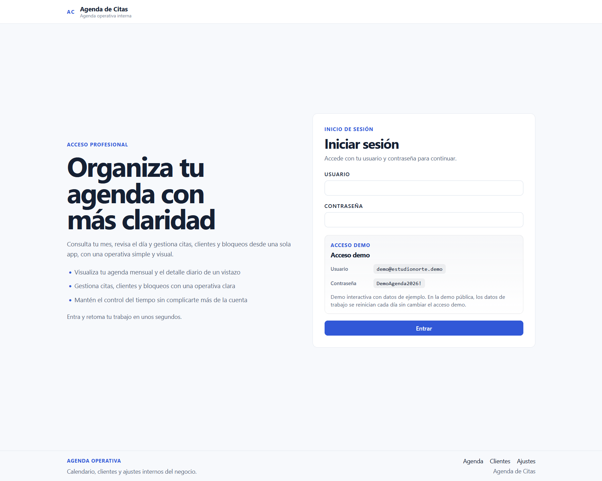
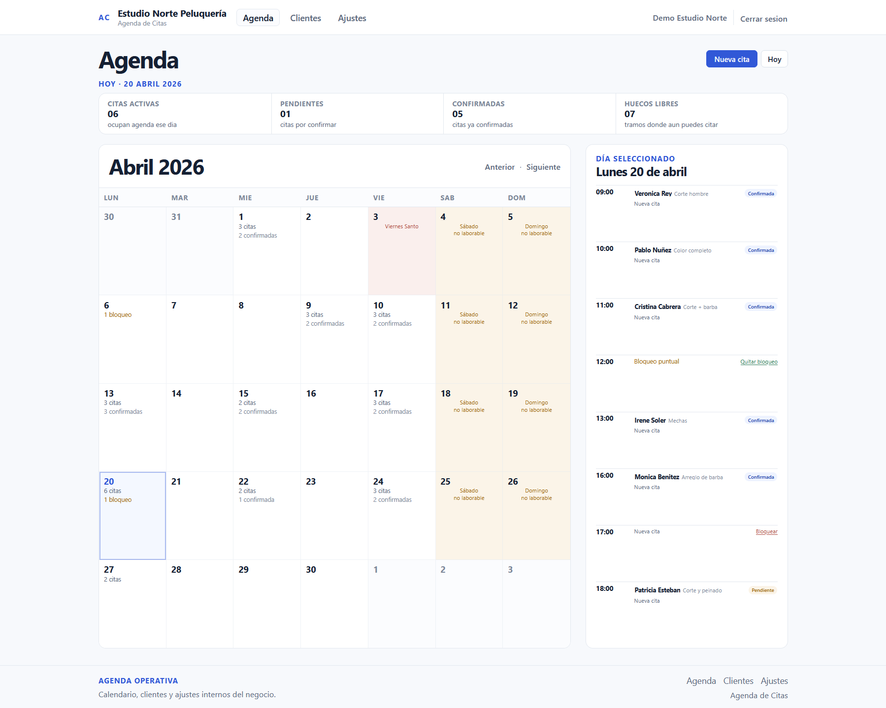
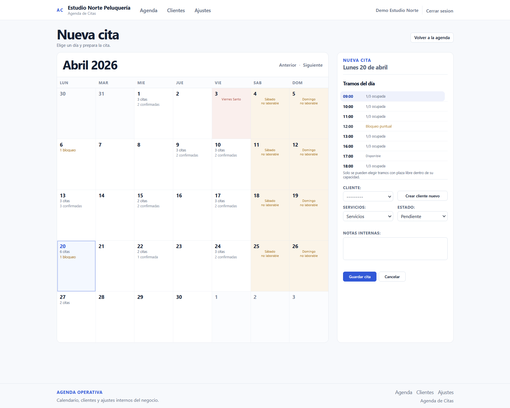
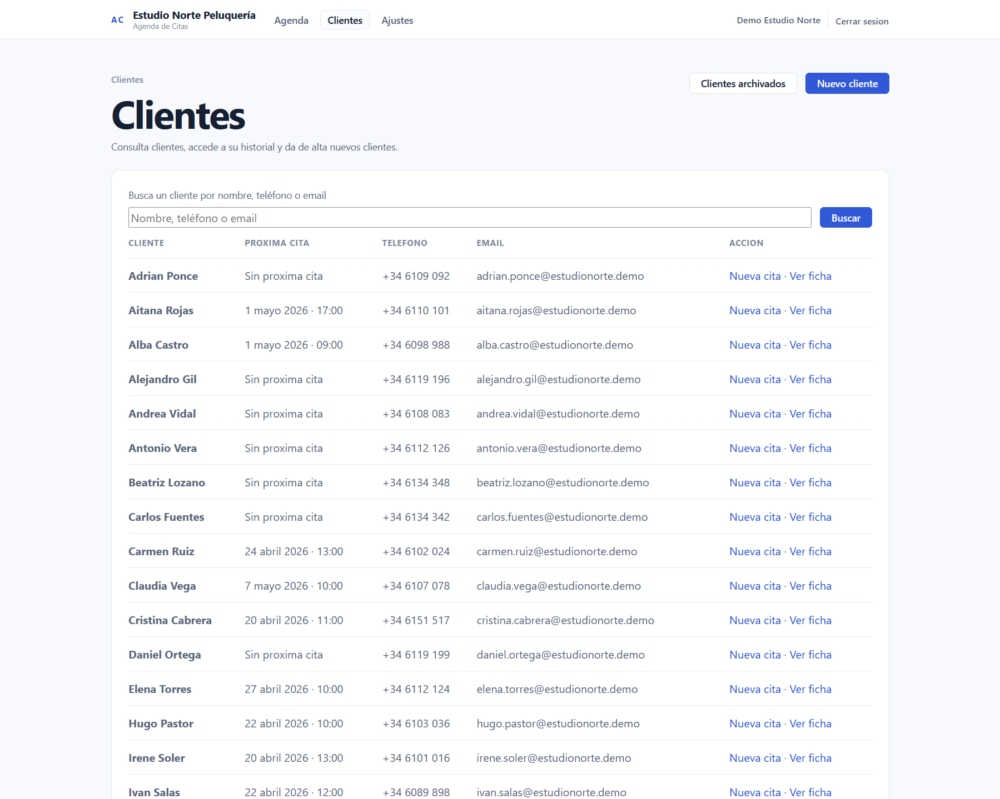

# Agenda de Citas

Aplicación web Django para gestionar agenda, citas, disponibilidad, clientes y servicios en negocios que trabajan por cita.

**Demo en vivo:** https://agenda.franciscojbravo.com  
**Acceso demo:** `demo@estudionorte.demo` / `DemoAgenda2026!`  
**Stack principal:** Python, Django, PostgreSQL, SQLite, HTML server-rendered, CSS propio, `htmx`

## Resumen

Agenda de Citas está planteada como una aplicación web server-rendered para negocios de servicios que necesitan una operativa clara y usable alrededor de su agenda diaria. El núcleo del producto está en `/app/`: calendario mensual, detalle del día, control por tramos horarios, citas, bloqueos y estados operativos reales.

La aplicación no busca inflar complejidad con un frontend separado ni con una arquitectura innecesaria para este alcance. Django actúa como fuente de verdad, la interacción es mayoritariamente renderizada en servidor y el JavaScript queda reducido a apoyos puntuales.

El proyecto incluye un contrato demo estable y reproducible. Las credenciales públicas son fijas, el dataset puede restaurarse con comando y la demo está pensada para poder resetearse de forma periódica sin cambiar el acceso.

## Vista previa

Estas son algunas vistas reales de la aplicación en su estado actual.

<p align="center">
  
  
</p>

<p align="center">
  
  
</p>

## Qué permite hacer

### Gestión de agenda

- navegar un calendario mensual con selección de día por querystring
- consultar el detalle diario de la agenda en una vista operativa única
- ver métricas del día como citas activas, pendientes, confirmadas y huecos libres
- detectar tramos con disponibilidad real
- bloquear tramos concretos de forma puntual
- distinguir días operativos, cierres manuales y festivos oficiales

### Gestión de citas

- crear, editar y cancelar citas desde el flujo principal
- asignar cliente y uno o varios servicios a cada cita
- trabajar sobre tramos fijos de agenda con capacidad controlada
- impedir reservas en tramos completos, bloqueados o en días no operativos
- mantener las citas canceladas en histórico sin mostrarlas en la agenda operativa

### Gestión de clientes

- consultar un listado de clientes activos
- buscar por nombre, teléfono o email
- abrir una ficha de cliente con datos básicos e historial
- crear una nueva cita desde la ficha del cliente
- archivar, reactivar o eliminar definitivamente clientes archivados
- crear un cliente nuevo sin salir del flujo de alta de cita

### Configuración operativa

- editar los datos básicos del negocio
- ajustar sábados, domingos y festivos oficiales como días no operativos
- gestionar cierres manuales por día o por rango
- sincronizar festivos nacionales oficiales desde BOE
- mantener un catálogo propio de servicios

### Demo y operación

- restaurar la demo compartida con `python manage.py reset_agenda_demo`
- mantener credenciales demo fijas
- reutilizar `python manage.py seed_agenda_demo` como comando compatible
- reconstruir un entorno demo repetible sin duplicar datos

## Qué incluye

- modelado relacional útil para agenda, citas, clientes, servicios y configuración
- renderizado en servidor con Django como fuente de verdad
- validaciones de disponibilidad, bloqueos, capacidad y días no operativos
- suite de tests con `Django TestCase`
- demo reproducible con comando de reset
- preparación para despliegue tradicional con PostgreSQL, Gunicorn y Nginx

## Stack utilizado

- **Python**
- **Django**
- **PostgreSQL** en producción
- **SQLite** en local
- **HTML renderizado en servidor**
- **CSS propio**
- **`htmx`** puntual para actualización parcial de la interfaz
- **Wagtail** como soporte de administración/CMS dentro del proyecto
- **Tests con Django TestCase**

## Demo en vivo

La aplicación está disponible en:

**https://agenda.franciscojbravo.com**

Puedes entrar con las credenciales demo vigentes:

- **Usuario:** `demo@estudionorte.demo`
- **Contraseña:** `DemoAgenda2026!`

## Cómo ejecutarlo en local

### 1. Clonar el repositorio

```bash
git clone https://github.com/fjbravo75/agenda-de-citas.git
cd agenda-de-citas
```

### 2. Crear y activar entorno virtual

```bash
python3 -m venv .venv
source .venv/bin/activate
```

### 3. Instalar dependencias

```bash
pip install -r requirements.txt
```

### 4. Preparar variables de entorno

Toma `.env.example` como referencia. Este repo no carga `.env` automáticamente, así que debes exportar las variables desde tu shell o tu gestor de procesos.

Si no defines ningún `POSTGRES_*`, el proyecto usa SQLite local en `db.sqlite3`.

### 5. Aplicar migraciones

```bash
python manage.py migrate
```

### 6. Cargar la demo local

```bash
python manage.py reset_agenda_demo
```

### 7. Levantar el servidor

```bash
python manage.py runserver
```

La aplicación quedará accesible en `http://127.0.0.1:8000/`.

## Variables de entorno

El proyecto incluye `.env.example` como referencia de configuración. Variables principales comprobadas en el repo:

- `SECRET_KEY`
- `DEBUG`
- `ALLOWED_HOSTS`
- `CSRF_TRUSTED_ORIGINS`
- `WAGTAILADMIN_BASE_URL`
- `TIME_ZONE`
- `POSTGRES_DB`
- `POSTGRES_USER`
- `POSTGRES_PASSWORD`
- `POSTGRES_HOST`
- `POSTGRES_PORT`

## Demo reproducible

El contrato demo vigente del proyecto es explícito y estable:

- **Usuario demo fijo:** `demo@estudionorte.demo`
- **Contraseña demo fija:** `DemoAgenda2026!`
- **Comando operativo de restauración:** `python manage.py reset_agenda_demo`
- **Comando compatible adicional:** `python manage.py seed_agenda_demo`

`reset_agenda_demo` recrea el dataset demo de agenda, clientes, servicios, bloqueos, cierres y citas desde una base limpia, y vuelve a fijar el acceso oficial de la demo si hubiera cambiado.

La previsión de producción para la demo pública es mantener un reset diario de datos ejecutando ese mismo comando, sin rotar las credenciales.

## Decisiones de implementación

- aplicación Django server-rendered
- agenda mensual y detalle diario como núcleo real del producto
- complejidad contenida, sin SPA ni frontend separado
- demo reproducible con credenciales fijas
- separación entre README público y guía técnica de despliegue
- contrato demo pensado para reset diario sin cambiar acceso

## Despliegue

La guía operativa de despliegue vive en [docs/deployment.md](docs/deployment.md).

El README se mantiene como documento público de presentación. Los detalles de bootstrap, variables de producción y operación de servidor quedan documentados aparte.

## Estado actual del proyecto

El proyecto tiene ya un nivel de acabado funcional sólido para portfolio y está preparado para un despliegue público tradicional.

La demo es reproducible, el acceso demo mantiene credenciales estables y los festivos oficiales sincronizados desde BOE ya se integran en el comportamiento operativo de la agenda.
